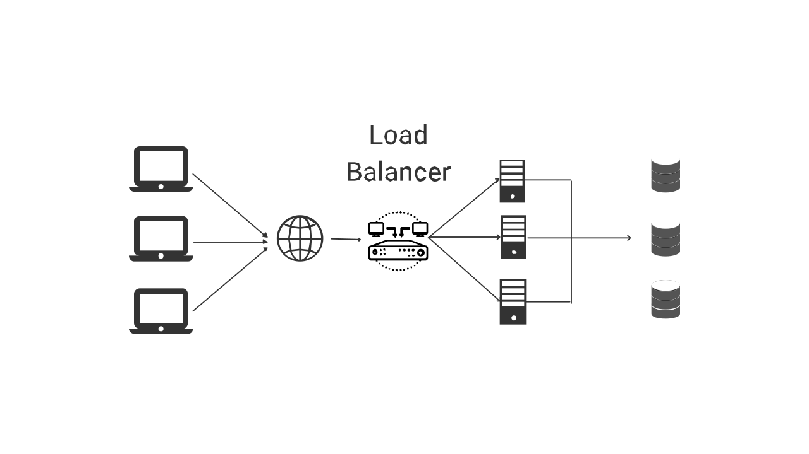
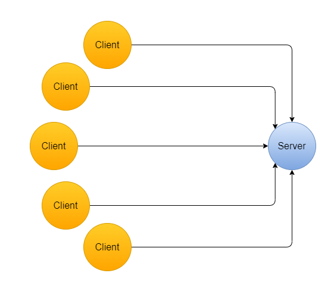
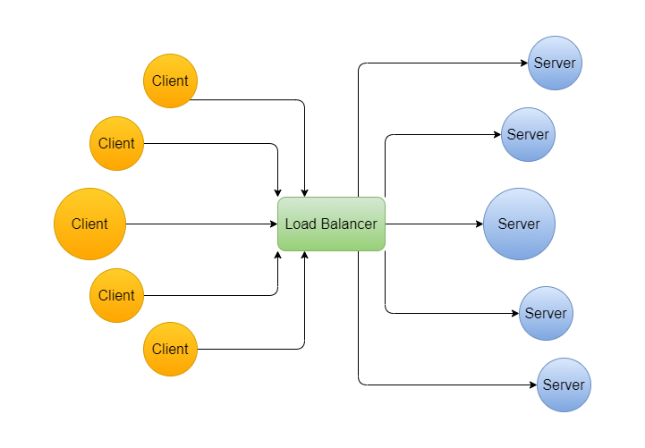

# Load Balancer

Load balancing is essential for building high-performance and scalable applications in system design. It is also a popular topic for system design tech interviews.

## What is a load balancer?

A load balancer is a software or a hardware device that sits between clients and a set of servers and balances workload across resources. It saves our servers from overloading and increases the throughput of the system.

## Why do we require a load balancer?

We use various web services in real life, which quickly respond to our requests. But most of us are unaware of the background process and scale of the system responsible for providing the fast response. This involves the allocation of requests across several servers when thousands of users request the service simultaneously.

On the other side, the load on servers keeps increasing with the traffic growth, and the website gets slower to serve the user request. To deliver a fast and reliable response, one idea would be to increase the number of servers. But this situation brings a new challenge: how to distribute the requests across several servers? We can solve this problem using the idea of a load balancer!

**Let's understand it from another perspective!**

Suppose we have several clients sending requests to a single server. When the number of requests increases significantly, the server experiences an overload, leading to failure in the system.

There will be two critical issues:
- **Server overloading**: There is always a limitation on a server to handle requests. After growth in the number of requests, the server may get overloaded.
- **Single point of failure**: If the single server goes down, the whole application will be unavailable for the users for a certain period of time. It will create a bad user experience.

**So, how do we handle the above problem?**

We can try to scale our system. The first way is to vertically scale our system or increase the power of our server. But, there's only so much that we can do about it to increase a single machine's power.

Another way is to scale the system horizontally by adding more servers to our system. Now for handling the request, we can add a load balancer and distribute the request across multiple servers. This could allow our services to handle a large number of requests by adding more servers.

Even if one of the servers goes offline due to some reason, the service will be available. It continuously checks the health of backend resources and prevents sending traffic to servers that cannot fulfill requests.

## Where do we add a load balancer?

We can add load balancers at various places in the system, especially with multiple resources like servers, databases, or caches.
- Between the client and the server
- Between the server and application servers
- Between the application and cache servers
- Between the cache and database servers

## What are the types of load balancers?

There can be two types of load balancers: **software load balancer** and **hardware load balancer**. The main difference between them is that we can do more with a software load balancer. We have more power for customization and scaling with software load balancers. With hardware load balancers, we are limited to the hardware we are given.

### Pros and cons of software load balancers

* Flexible in adjusting to changing needs
* Able to scale beyond initial capacity by adding more software instances.
* Lower cost than purchasing and maintaining physical hardware. The software can run on any standard device, which tends to be cheaper.
* It can allow cloud-based load balancing.
* There can be some delay when scaling beyond initial capacity while configuring load balancer software.
* There will be some extra costs for ongoing upgrades.

### Examples of software load balancers

- HAProxy: A TCP load balancer.
- NGINX: An HTTP load balancer with SSL termination support.
- mod_athena: Apache-based HTTP load balancer.
- Varnish: A reverse proxy-based load balancer.
- Balance: Open-source TCP load balancer.
- LVS: Linux virtual server offering layer 4 load balancing.

### Pros and cons of hardware load balancers

* Provide fast throughput due to software running on specialized processors.
* Increase security because only the organization can access the servers physically.
* Need more human resources and expertise to configure and manage the machines.
* It fails to scale when the number of requests exceeds a specific limit.
* It requires a higher cost for purchase and maintenance.

### Examples of hardware load balancers

- F5 BIG-IP load balancer
- CISCO system catalyst
- Barracuda load balancer
- Coytepoint load balancer
- Citrix NetScaler

## Advantages of load balancing

- We use a load balancer for better user experience and uninterrupted service by distributing the client requests to an available and responsive server. In other words, it ensures the availability and scalability of the application.
- It prevents server overload and a single point of failure. In other words, it ensures that no single server bears too many requests that degrade the application's overall performance.
- It can also offer functionalities like encryption, authentication, etc. to provide a single control point for securing, managing, and monitoring the application. It can provide efficient protection from the DoS attack.
- The end-user only needs to know the address of the load balancer, not the address of every server in the cluster. So it also provides a layer of Abstraction.
- We can roll out software updates without taking the whole service down by using the load balancer to take out one server at a time.
- It minimizes server response time and maximizes throughput.
- It can do health checks and monitor the request handling capability of servers.
- Based on the number of requests, it can add or remove the number of servers.

## Critical concepts to explore further

- What is the difference between Load Balancer and Reverse Proxy?
- Different Categories of Load Balancing: 
    1. Layer 4 (L4) load balancer 
    2. Layer 7 (L7) load balancer 
    3. Global server load balancing (GSLB)
- Health check feature of the load balancer.
- DNS load balancing vs Hardware load balancing
- The application load balancer in designing several systems
- Cloud load balancing

