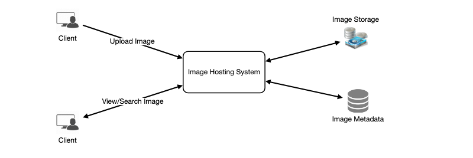
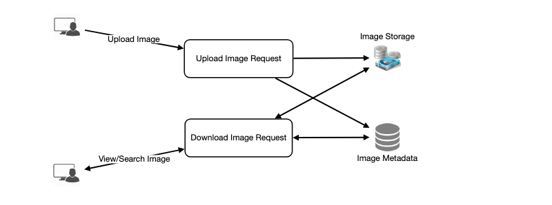

# Thiết Kế Instagram

*Thiết kế hệ thống chia sẻ hình ảnh tương tự Instagram, nơi người dùng có thể tải ảnh của họ lên và chia sẻ với người khác.*

## Instagram là gì?

Instagram là trang mạng xã hội cho phép người dùng tải và chia sẻ hình ảnh hay video với những người khác. Người dùng Instagram có thể chọn cách chia sẻ nội dung của họ là công khai hay riêng tư. Các nội dung công khai có thể được xem bởi bất kỳ ai, còn nội dung riêng tư thì chỉ có những người dùng được chỉ định mới có thể truy cập được. Instagram còn cho phép người dùng chia sẻ trên nhiều nền tảng khác như Facebook, Twitter, Flickr hay Tumblr.

Trong bài viết này, chúng ta sẽ chỉ thiết kế một phiên bản đơn giản của Instagram, để người dùng có thể chia sẻ anh và theo dõi các người dùng khác. Trang "News Feed" sẽ bao gồm các ảnh mà người dùng đó đang theo dõi.

## Yêu cầu và Mục tiêu

Ta sẽ tập trung vào tập yêu cầu chính khi thiết kế Instagram:

### Yêu cầu bắt buộc

1. Người dùng có thể tải lên/tải xuống/xem hình ảnh.
2. Người dùng có thể tìm kiếm dựa trên tiêu đề của ảnh/video.
3. Người dùng có thể theo dõi người khác.
4. Hệ thống nên có chức năng hiển thị các ảnh nổi bật của những người mà người dùng theo dõi trên News Feed.

### Yêu cầu không bắt buộc

1. Hệ thống nên có tính khả dụng cao
2. Độ trễ chấp nhận được trong hệ thống là 200ms cho trang News Feed.
3. Có thể hy sinh tính nhất quán cho tính khả dụng, nếu người dùng không thể xem ảnh trong một khoảng khắc nào đó, thì đó không phải vấn đề quá lớn.
4. Hệ thống nên có độ tin cậy cao, để ảnh hay video không bao giờ bị mất.

**Không trong phạm vi:** Thêm tag cho ảnh, tìm kiếm bằng tag, bình luận, tag người dùng,...

### Một vài thiết kế cần xem xét

Hệ thống sẽ thiên về việc đọc dữ liệu, nên chúng ta sẽ tập trung vào xây dựng hệ thống cho truy xuất hình ảnh nhanh chóng.
1. Người dùng có thể đăng lên số lượng ảnh tuỳ thích. Thế nên việc quản lý bộ lưu trữ một cách hiệu quả là nhân tố quan trọng khi thiết kế hệ thống này.
2. Độ trễ thấp khi người dùng xem ảnh.
3. Dữ liệu nên được đảm bảo 100%. Nếu người dùng đăng ảnh hệ thống sẽ đảm bảo nó không bao giờ bị mất.

### Các tính toán cơ bản

- Giả sử tả có 500 triệu người dùng, trong đó có 1 triệu người dùng mỗi ngày.
- 2 triệu ảnh mỗi ngày, 23 ảnh mới mỗi giây.
- Dung lượng trung bình mỗi ảnh không lớn hơn 200KB.
- Tổng dung lượng mỗi ngày là: 2M * 200KB => 400GB
- Dung lượng trong 10 năm: 400GB * 365 * 10 ~= 1425TB

### Thiết kế cấp cao

Ở mức độ này, ta có 2 trường hợp là một là tải ảnh lên hai là xem/tìm ảnh. Dịch vụ của chúng ta cung cấp một server dạng storage cho lưu trữ ảnh và một server cơ sở dữ liệu cho thông tin metadata của ảnh.



### Cơ sở dữ liệu

> Thiết kế lược đồ cơ sở dữ liệu là bước sớm nhất giúp hiểu được luồng hoạt động của dữ liệu với các thành phần khác nhau và là hướng dẫn cho phân vùng dữ liệu về sau.

Ta cần lưu trữ dữ liệu người dùng, ảnh mà họ đăng lên và các người mà họ theo dõi. Bảng `Photo` sẽ lưu trữ tất cả dữ liệu liên quan đến ảnh, và ta cần đánh chỉ mục trên `PhotoID`, `CreationDate` vì ta cần lấy các bức ảnh gần đây nhất.


Cách tiếp cận thông thường để lưu trữ các lược đồ dữ liệu ở trên là sử dụng một RDBMS như MySQL vì ta cần thực hiện JOIN. Song các cơ sở dữ liệu quan hệ (SQL) cũng đi kèm nhiều thử thách khi ta mở rộng chúng. 

Về phía hình ảnh ta sẽ lưu chúng bằng các dịch vụ lưu trữ file phân tán như HDFS hay S3.

Ta cũng có thể lưu trữ các lược đồ dữ liệu trên trong các cơ sở dữ liệu NoSQL dạng key-value. Ví dụ như với bảng `Photo` thì **key** có thể là `PhotoID` và **value** là một đối tượng bao gồm: `PhotoLocation`, `UserLocation`, `CreationTimestamp`,...

Trong trường hợp ta cần lưu trữ mối quan hệ giữa người dùng và ảnh, để biết ảnh nào được đăng bởi ai. Đồng thời ta cũng cần lưu trữ danh sách người dùng được theo dõi. Với cả hai bảng này ta có thể sử dụng cơ sở dữ liệu NoSQL hướng column như Cassandra. Ví dụ như với bảng `UserPhoto`, **key** có thể là `UserID` và **value** là danh sách các `PhotoIDs` mà người dùng sở hữu, được lưu ở các cột khác. Ta sẽ có một lược đồ tương tự với bảng `UserFollow`.

### Ước lượng kích cỡ dữ liệu

Ta sẽ đi đến các tính toán xem cần bao nhiều dữ liệu cho mỗi bảng và tổng dung lượng mà ta cần cho 10 năm.

- **User**: giả sr kiểu `int` và `datetime` đều là 4 bytes, mỗi hàng trong bảng User sẽ cần 68 bytes:

> UserID (4 bytes) + Name (20 bytes) + Email (32 bytes) + DateOfBirth (4 bytes) + CreationDate (4 bytes) + LastLogin (4 bytes) = 68 bytes

Nếu ta có 500 triệu người dùng, ta sẽ cần 32GB cho tổng dung lượng.

> 500M * 68 ~= 32GB

- **Photo**: Mỗi hàng trong bảng Photo sẽ là 284 bytes:

> PhotoID (4 bytes) + UserID (4 bytes) + PhotoPath (256 bytes) + PhotoLatitude (4 bytes) + PhotLongitude(4 bytes) + UserLatitude (4 bytes) + UserLongitude (4 bytes) + CreationDate (4 bytes) = 284 bytes

Nếu có 2 triệu người dùng đăng ảnh mỗi ngày, ta sẽ cần 0.5GB mỗi ngày:

> 2M * 284 bytes ~= 0.5GB per day

Như vậy trong 10 năm sẽ là 1.88TB 

- **UserFollow**: Mỗi hàng trong bảng UserFollow sẽ là 8 bytes. Nếu ta có 500 triệu người dùng và trung bình một người có 500 người theo dõi. Ta sẽ cần 1.82TB cho bảng UserFollow:

> 500 million users * 500 followers * 8 bytes ~= 1.82TB

Tổng dung lượng yêu cầu ở cả 3 bảng là:

```
32GB + 1.88TB + 1.82TB ~= 3.7TB
```

### Thiết kế thành phần

Quá trình tải ảnh lên (ghi dữ liệu) có thể sẽ chậm do các thành phần ổ cứng, ngược lại việc xem ảnh (đọc dữ liệu) lại nhanh hơn, đặc biệt là khi dùng bộ đệm.

Việc tải ảnh lên của người dùng có thể sẽ tiêu thụ hết tất cả các kết nối khả dung, mà đây lại là một tiến trình chậm. Nên có thể dẫn đến việc các tiến trình đọc dữ liệu sẽ không thể thực hiện khi mà hệ thống quá bận với các yêu cầu ghi dữ liệu. Có một điều cần phải nhớ khi thiết kế hệ thống là có một số lượng giới hạn các kết nối được phép đến server. Giả sử ta thiết lập là 500, thì trong cùng thời điểm chỉ có tối đa 500 kết nối được phép đến server. Nếu 500 kết nối này đều là yêu cầu ghi thì ta không thể thực hiện bất kỳ thao tác đọc dữ liệu nào cho đến khi một kết nối ghi hoàn tất.

Để giải quyết bài toán nghẽn cổ chai này, ta cần tách hệ thống của chúng ta thành hai dịch vụ: một bên chỉ cho đọc dữ liệu và bên còn lại cho ghi dữ liệu để đảm bảo rằng quá trình đăng ảnh sẽ không làm sập hệ thống.

Với việc tách ra như vậy, ta có thể mở rộng dịch vụ xem ảnh và tải ảnh lên một cách độc lập và tối ưu hơn.



### Độ tin cậy và dự phòng

