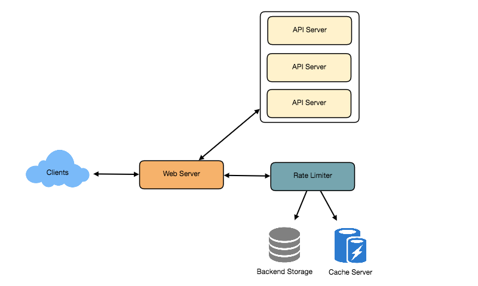
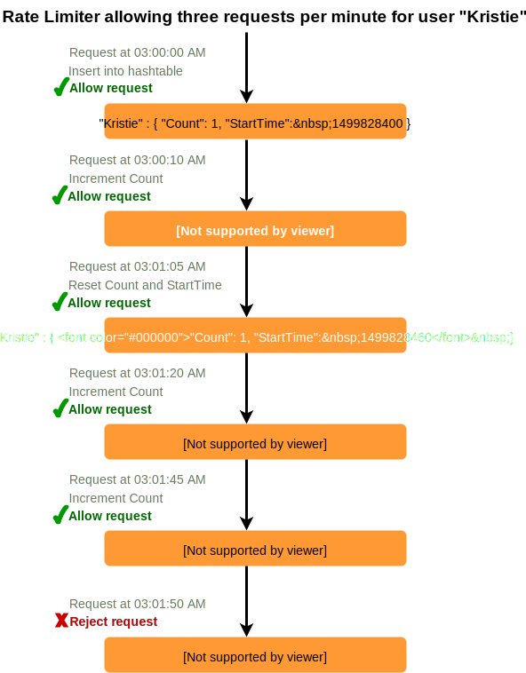
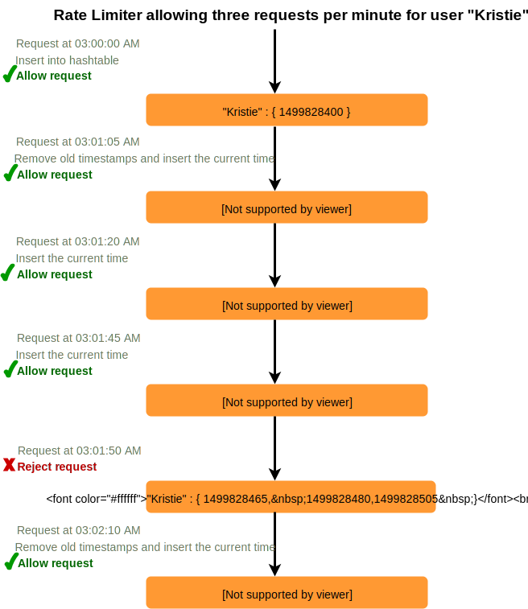
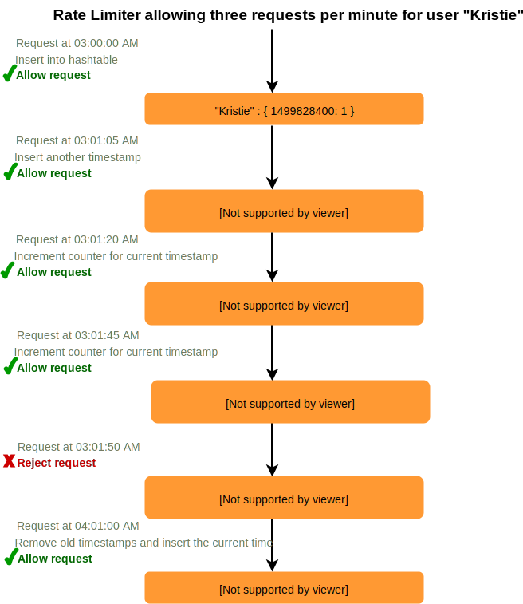

# System Design an API Rate Limiter

Let's design an API Rate Limiter which will throttle users based upon the number of the requests they are sending.

Difficulty Level: Medium

## 1. What is a Rate Limiter?

Imagine we have a service which is receiving a huge number of requests, but it can only serve a limited number of requests per second. To handle this problem we would need some kind of throttling or rate limiting mechanism that would allow only a certain number of requests so our service can respond to all of them. A rate limiter, at a high-level, limits the number of events an entity (user, device, IP, etc.) can perform in a particular time window. For example:

- A user can send only one message per second.
- A user is allowed only three failed credit card transactions per day.
- A single IP can only create twenty accounts per day.

In general, a rate limiter caps how many requests a sender can issue in a specific time window. It then blocks requests once the cap is reached.

## 2. Why do we need API rate limiting?

Rate Limiting helps to protect services against abusive behaviors targeting the application layer like Denial-of-service (DOS) attacks, brute-force password attempts, brute-force credit card transactions, etc. These attacks are usually a barrage of HTTP/S requests which may look like they are coming from real users, but are typically generated by machines (or bots). As a result, these attacks are often harder to detect and can more easily bring down a service, application, or an API.

Rate limiting is also used to prevent revenue loss, to reduce infrastructure costs, to stop spam, and to stop online harassment. Following is a list of scenarios that can benefit from Rate limiting by making a service (or API) more reliable:

- **Misbehaving clients/scripts**: Either intentionally or unintentionally, some entities can overwhelm a service by sending a large number of requests. Another scenario could be when a user is sending a lot of lower-priority requests and we want to make sure that it doesn’t affect the high-priority traffic. For example, users sending a high volume of requests for analytics data should not be allowed to hamper critical transactions for other users.
- **Security**: By limiting the number of the second-factor attempts (in 2-factor auth) that the users are allowed to perform, for example, the number of times they’re allowed to try with a wrong password.
To prevent abusive behavior and bad design practices: Without API limits, developers of client applications would use sloppy development tactics, for example, requesting the same information over and over again.
- **To keep costs and resource usage under control**: Services are generally designed for normal input behavior, for example, a user writing a single post in a minute. Computers could easily push thousands/second through an API. Rate limiter enables controls on service APIs.
- **Revenue**: Certain services might want to limit operations based on the tier of their customer’s service and thus create a revenue model based on rate limiting. There could be default limits for all the APIs a service offers. To go beyond that, the user has to buy higher limits
- **To eliminate spikiness in traffic**: Make sure the service stays up for everyone else.

## 3. Requirements and Goals of the System

Our Rate Limiter should meet the following requirements:

### Functional Requirements:

1. Limit the number of requests an entity can send to an API within a time window, e.g., 15 requests per second.
2. The APIs are accessible through a cluster, so the rate limit should be considered across different servers. The user should get an error message whenever the defined threshold is crossed within a single server or across a combination of servers.

### Non-Functional Requirements:

1. The system should be highly available. The rate limiter should always work since it protects our service from external attacks.
2. Our rate limiter should not introduce substantial latencies affecting the user experience.

## 4. How to do Rate Limiting?

Rate Limiting is a process that is used to define the rate and speed at which consumers can access APIs. Throttling is the process of controlling the usage of the APIs by customers during a given period. Throttling can be defined at the application level and/or API level. When a throttle limit is crossed, the server returns HTTP status `429 - Too many requests`.

## 5. What are different types of throttling?

Here are the three famous throttling types that are used by different services:

**Hard Throttling**: The number of API requests cannot exceed the throttle limit.

**Soft Throttling**: In this type, we can set the API request limit to exceed a certain percentage. For example, if we have rate-limit of 100 messages a minute and 10% exceed-limit, our rate limiter will allow up to 110 messages per minute.

**Elastic or Dynamic Throttling**: Under Elastic throttling, the number of requests can go beyond the threshold if the system has some resources available. For example, if a user is allowed only 100 messages a minute, we can let the user send more than 100 messages a minute when there are free resources available in the system.

## 6. What are different types of algorithms used for Rate Limiting?

Following are the two types of algorithms used for Rate Limiting:

**Fixed Window Algorithm:** In this algorithm, the time window is considered from the start of the time-unit to the end of the time-unit. For example, a period would be considered 0-60 seconds for a minute irrespective of the time frame at which the API request has been made. In the diagram below, there are two messages between 0-1 second and three messages between 1-2 seconds. If we have a rate limiting of two messages a second, this algorithm will throttle only ‘m5’.

**Rolling Window Algorithm:** In this algorithm, the time window is considered from the fraction of the time at which the request is made plus the time window length. For example, if there are two messages sent at the 300th millisecond and 400th millisecond of a second, we’ll count them as two messages from the 300th millisecond of that second up to the 300th millisecond of next second. In the above diagram, keeping two messages a second, we’ll throttle ‘m3’ and ‘m4’.

## 7. High level design for Rate Limiter

Rate Limiter will be responsible for deciding which request will be served by the API servers and which request will be declined. Once a new request arrives, the Web Server first asks the Rate Limiter to decide if it will be served or throttled. If the request is not throttled, then it’ll be passed to the API servers.

## 8. Basic System Design and Algorithm

Let’s take the example where we want to limit the number of requests per user. Under this scenario, for each unique user, we would keep a count representing how many requests the user has made and a timestamp when we started counting the requests. We can keep it in a hashtable, where the ‘key’ would be the ‘UserID’ and ‘value’ would be a structure containing an integer for the ‘Count’ and an integer for the Epoch time:

Let’s assume our rate limiter is allowing three requests per minute per user, so whenever a new request comes in, our rate limiter will perform the following steps:

1. If the `UserID` is not present in the hash-table, insert it, set the `Count` to 1, set `StartTime` to the current time (normalized to a minute), and allow the request.

2. Otherwise, find the record of the `UserID` and if `CurrentTime – StartTime >= 1 min`, set the `StartTime` to the current time, `Count` to 1, and allow the request.

3. If `CurrentTime - StartTime <= 1 min` and
    - If `Count < 3`, increment the `Count` and allow the request.
    - If `Count >= 3`, reject the request.

**What are some of the problems with our algorithm?**

1. This is a **Fixed Window** algorithm since we’re resetting the `StartTime` at the end of every minute, which means it can potentially allow twice the number of requests per minute. Imagine if Kristie sends three requests at the last second of a minute, then she can immediately send three more requests at the very first second of the next minute, resulting in 6 requests in the span of two seconds. The solution to this problem would be a sliding window algorithm which we’ll discuss later.

2. **Atomicity**: In a distributed environment, the `read-and-then-write` behavior can create a race condition. Imagine if Kristie’s current `Count` is `2` and that she issues two more requests. If two separate processes served each of these requests and concurrently read the Count before either of them updated it, each process would think that Kristie could have one more request and that she had not hit the rate limit.

If we are using Redis to store our key-value, one solution to resolve the atomicity problem is to use Redis lock for the duration of the read-update operation. This, however, would come at the expense of slowing down concurrent requests from the same user and introducing another layer of complexity. We can use Memcached, but it would have comparable complications.

If we are using a simple hash-table, we can have a custom implementation for ‘locking’ each record to solve our atomicity problems.

**How much memory would we need to store all of the user data?** Let’s assume the simple solution where we are keeping all of the data in a hash-table.

Let’s assume `UserID` takes 8 bytes. Let’s also assume a 2 byte `Count`, which can count up to 65k, is sufficient for our use case. Although epoch time will need 4 bytes, we can choose to store only the minute and second part, which can fit into 2 bytes. Hence, we need a total of 12 bytes to store a user’s data:

> 8 + 2 + 2 = 12 bytes

Let’s assume our hash-table has an overhead of 20 bytes for each record. If we need to track one million users at any time, the total memory we would need would be 32MB:

> (12 + 20) bytes * 1 million => 32MB
If we assume that we would need a 4-byte number to lock each user’s record to resolve our atomicity problems, we would require a total 36MB memory.

This can easily fit on a single server; however we would not like to route all of our traffic through a single machine. Also, if we assume a rate limit of 10 requests per second, this would translate into 10 million QPS for our rate limiter! This would be too much for a single server. Practically, we can assume we would use a Redis or Memcached kind of a solution in a distributed setup. We’ll be storing all the data in the remote Redis servers and all the Rate Limiter servers will read (and update) these servers before serving or throttling any request.

## 9. Sliding Window algorithm

We can maintain a sliding window if we can keep track of each request per user. We can store the timestamp of each request in a Redis Sorted Set in our ‘value’ field of hash-table.

Let’s assume our rate limiter is allowing three requests per minute per user, so, whenever a new request comes in, the Rate Limiter will perform following steps:

1. Remove all the timestamps from the Sorted Set that are older than `CurrentTime - 1 minute`.
2. Count the total number of elements in the sorted set. Reject the request if this count is greater than our throttling limit of `3`.
3. Insert the current time in the sorted set and accept the request.

**How much memory would we need to store all of the user data for sliding window?** Let’s assume `UserID` takes 8 bytes. Each epoch time will require 4 bytes. Let’s suppose we need a rate limiting of 500 requests per hour. Let’s assume 20 bytes overhead for hash-table and 20 bytes overhead for the Sorted Set. At max, we would need a total of 12KB to store one user’s data:

> 8 + (4 + 20 (sorted set overhead)) * 500 + 20 (hash-table overhead) = 12KB

Here we are reserving 20 bytes overhead per element. In a sorted set, we can assume that we need at least two pointers to maintain order among elements — one pointer to the previous element and one to the next element. On a 64bit machine, each pointer will cost 8 bytes. So we will need 16 bytes for pointers. We added an extra word (4 bytes) for storing other overhead.

If we need to track one million users at any time, total memory we would need would be 12GB:

> 12KB * 1 million ~= 12GB

Sliding Window Algorithm takes a lot of memory compared to the Fixed Window; this would be a scalability issue. What if we can combine the above two algorithms to optimize our memory usage?

## 10. Sliding Window with Counters

What if we keep track of request counts for each user using multiple fixed time windows, e.g., 1/60th the size of our rate limit’s time window. For example, if we have an hourly rate limit we can keep a count for each minute and calculate the sum of all counters in the past hour when we receive a new request to calculate the throttling limit. This would reduce our memory footprint. Let’s take an example where we rate-limit at 500 requests per hour with an additional limit of 10 requests per minute. This means that when the sum of the counters with timestamps in the past hour exceeds the request threshold (500), Kristie has exceeded the rate limit. In addition to that, she can’t send more than ten requests per minute. This would be a reasonable and practical consideration, as none of the real users would send frequent requests. Even if they do, they will see success with retries since their limits get reset every minute.

We can store our counters in a Redis Hash since it offers incredibly efficient storage for fewer than 100 keys. When each request increments a counter in the hash, it also sets the hash to expire an hour later. We will normalize each ‘time’ to a minute.

**How much memory we would need to store all the user data for sliding window with counters?** Let’s assume `UserID` takes 8 bytes. Each epoch time will need 4 bytes, and the Counter would need 2 bytes. Let’s suppose we need a rate limiting of 500 requests per hour. Assume 20 bytes overhead for hash-table and 20 bytes for Redis hash. Since we’ll keep a count for each minute, at max, we would need 60 entries for each user. We would need a total of 1.6KB to store one user’s data:

> 8 + (4 + 2 + 20 (Redis hash overhead)) * 60 + 20 (hash-table overhead) = 1.6KB

If we need to track one million users at any time, total memory we would need would be 1.6GB:

> 1.6KB * 1 million ~= 1.6GB

So, our ‘Sliding Window with Counters’ algorithm uses 86% less memory than the simple sliding window algorithm.

## 11. Data Sharding and Caching

We can shard based on the `UserID` to distribute the user’s data. For fault tolerance and replication we should use Consistent Hashing. If we want to have different throttling limits for different APIs, we can choose to shard per user per API. Take the example of URL Shortener; we can have different rate limiter for `createURL()` and `deleteURL()` APIs for each user or IP.

If our APIs are partitioned, a practical consideration could be to have a separate (somewhat smaller) rate limiter for each API shard as well. Let’s take the example of our URL Shortener where we want to limit each user not to create more than 100 short URLs per hour. Assuming we are using **Hash-Based Partitioning** for our `createURL()` API, we can rate limit each partition to allow a user to create not more than three short URLs per minute in addition to 100 short URLs per hour.

Our system can get huge benefits from caching recent active users. Application servers can quickly check if the cache has the desired record before hitting backend servers. Our rate limiter can significantly benefit from the **Write-back cache** by updating all counters and timestamps in cache only. The write to the permanent storage can be done at fixed intervals. This way we can ensure minimum latency added to the user’s requests by the rate limiter. The reads can always hit the cache first; which will be extremely useful once the user has hit their maximum limit and the rate limiter will only be reading data without any updates.

Least Recently Used (LRU) can be a reasonable cache eviction policy for our system.

## 12. Should we rate limit by IP or by user?

Let’s discuss the pros and cons of using each one of these schemes:

**IP**: In this scheme, we throttle requests per-IP; although it’s not optimal in terms of differentiating between ‘good’ and ‘bad’ actors, it’s still better than not have rate limiting at all. The biggest problem with IP based throttling is when multiple users share a single public IP like in an internet cafe or smartphone users that are using the same gateway. One bad user can cause throttling to other users. Another issue could arise while caching IP-based limits, as there are a huge number of IPv6 addresses available to a hacker from even one computer, it’s trivial to make a server run out of memory tracking IPv6 addresses!

**User**: Rate limiting can be done on APIs after user authentication. Once authenticated, the user will be provided with a token which the user will pass with each request. This will ensure that we will rate limit against a particular API that has a valid authentication token. But what if we have to rate limit on the login API itself? The weakness of this rate-limiting would be that a hacker can perform a denial of service attack against a user by entering wrong credentials up to the limit; after that the actual user will not be able to log-in.

**How about if we combine the above two schemes?**

**Hybrid**: A right approach could be to do both per-IP and per-user rate limiting, as they both have weaknesses when implemented alone, though, this will result in more cache entries with more details per entry, hence requiring more memory and storage.